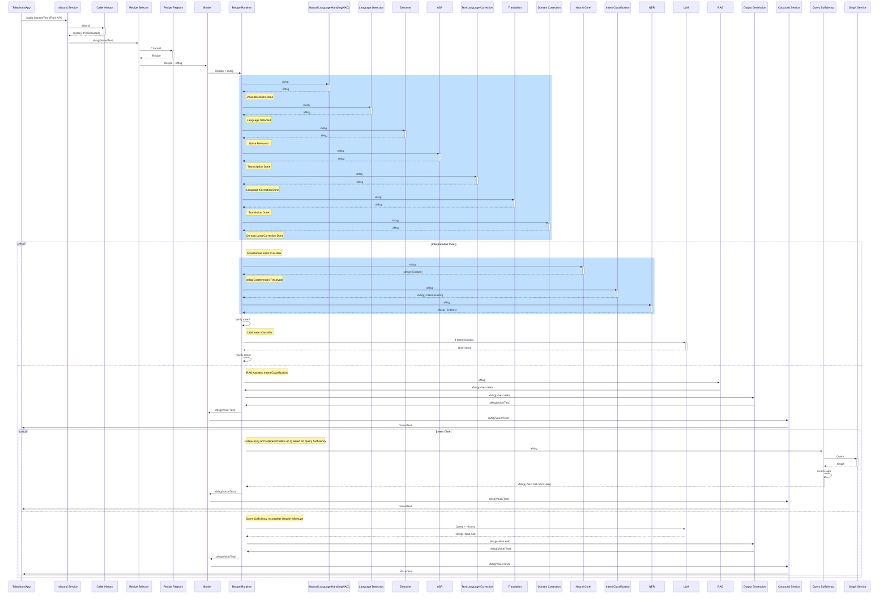

```mermaid
sequenceDiagram
    Telephony/App->>+Inbound Service: Audio Stream/Text (Their API)
    Inbound Service->>+Caller History: UserId
    Caller History-->>-Inbound Service: History (PII Redacted)
    Inbound Service->>+Recipe Selector: xMsg(Voice/Text)
    Recipe Selector->>+Recipe Registry: Channel
    Recipe Registry-->>-Recipe Selector: Recipe
    Recipe Selector->>+Broker: Recipe + xMsg
    Broker->>+Recipe Runtime: Recipe + xMsg

    rect rgb(191, 223, 255)
    Recipe Runtime->>+Natural Language Handling(VAD): xMsg
    Natural Language Handling(VAD)-->>-Recipe Runtime: xMsg
    note right of Recipe Runtime: Voice Detection Done
    
    Recipe Runtime->>+Language Detection: xMsg
    Language Detection-->>-Recipe Runtime: xMsg
    note right of Recipe Runtime: Language Detected
    
    Recipe Runtime->>+Denoiser: xMsg
    Denoiser-->>-Recipe Runtime: xMsg 
    note right of Recipe Runtime: Noise Removed

    Recipe Runtime->>+ASR: xMsg
    ASR-->>-Recipe Runtime: xMsg
    note right of Recipe Runtime: Transcription Done

    Recipe Runtime->>+Text Language Correction: xMsg
    Text Language Correction-->>-Recipe Runtime: xMsg
    note right of Recipe Runtime: Language Correction Done
    
    Recipe Runtime->>+Translation: xMsg
    Translation-->>-Recipe Runtime: xMsg
    note right of Recipe Runtime: Translation Done

    Recipe Runtime->>+Domain Correction: xMsg
    Domain Correction-->>-Recipe Runtime: xMsg
    note right of Recipe Runtime: Domain Lang Correction Done
    end
    
    critical Interpretation Clear
        note right of Recipe Runtime: Small Model Intent Classifier

        rect rgb(191, 223, 255)
            Recipe Runtime->>+ Neural Coref: xMsg
            Neural Coref-->>-Recipe Runtime: xMsg(+Entities)
            note right of Recipe Runtime: xMsg(Coreferences Resolved)

            Recipe Runtime->>+Intent Classification: xMsg
            Intent Classification-->>-Recipe Runtime: xMsg(+Classification)

            Recipe Runtime->>+NER: xMsg
            NER-->>-Recipe Runtime: xMsg(+Entities)
        end

        
        Recipe Runtime->>+Recipe Runtime: Verify Intent

        note right of Recipe Runtime: LLM Intent Classifier 
        Recipe Runtime->>+LLM: if Intent Unclear
        LLM-->>-Recipe Runtime: User Intent
        Recipe Runtime->>+Recipe Runtime: Verify Intent

        option
            note right of Recipe Runtime: RAG Assisted Intent Classification
            Recipe Runtime->>+RAG: xMsg

            RAG->>+Recipe Runtime: xMsg(+Next Ask)
            Recipe Runtime->>+Output Generation: xMsg(+Next Ask)
            Output Generation->>+Recipe Runtime: xMsg(Voice/Text)
            Recipe Runtime->>+Broker: xMsg(Voice/Text)
            Broker->>+Outbound Service: xMsg(Voice/Text)
            Outbound Service->>+Telephony/App: Voice/Text

        critical Intent Clear
            note right of Recipe Runtime: Follow up Q and rephrased follow up Q asked for Query Sufficiency
            Recipe Runtime->>+Query Sufficiency: xMsg
            Query Sufficiency->>+Graph Service: Query
            Graph Service-->>-Query Sufficiency: Graph
            Query Sufficiency->>+Query Sufficiency: Eval Graph
            Query Sufficiency-->>-Recipe Runtime: xMsg(+Next Ask from User)
            Recipe Runtime->>+Broker: xMsg(Voice/Text)
            Broker->>+Outbound Service: xMsg(Voice/Text)
            Outbound Service->>+Telephony/App: Voice/Text
            
            option
                note right of Recipe Runtime: Query Sufficiency Incomplete despite followups
                    Recipe Runtime->>+LLM: Query + History
                    LLM-->>+Recipe Runtime: xMsg(+Next Ask)
                    Recipe Runtime->>+Output Generation: xMsg(+Next Ask)
                    Output Generation->>+Recipe Runtime: xMsg(Voice/Text)
                    Recipe Runtime->>+Broker: xMsg(Voice/Text)
                    Broker->>+Outbound Service: xMsg(Voice/Text)
                    Outbound Service->>+Telephony/App: Voice/Text
            
        end
    end
```
