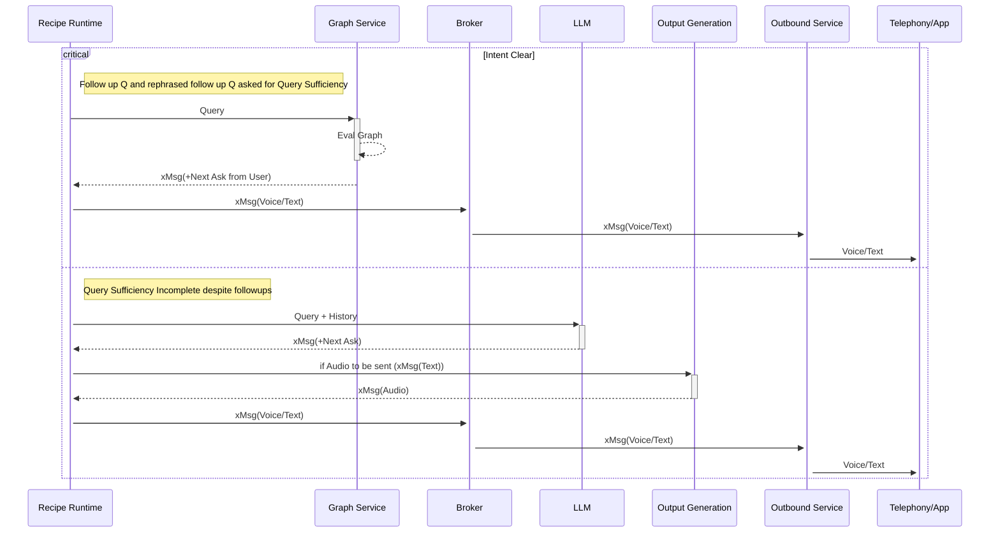

```mermaid
sequenceDiagram
participant Recipe Runtime
participant Graph Service
participant Broker
participant LLM
participant Output Generation
participant Outbound Service
participant Telephony/App

critical Intent Clear
    note right of Recipe Runtime: Follow up Q and rephrased follow up Q asked for Query Sufficiency
    Recipe Runtime->>+Graph Service: Query
    Graph Service-->>-Graph Service: Eval Graph
    Graph Service-->>+Recipe Runtime: xMsg(+Next Ask from User)
    Recipe Runtime->>+Broker: xMsg(Voice/Text)
    Broker->>+Outbound Service: xMsg(Voice/Text)
    Outbound Service->>+Telephony/App: Voice/Text
    
    option
        note right of Recipe Runtime: Query Sufficiency Incomplete despite followups
            Recipe Runtime->>+LLM: Query + History
            LLM-->>-Recipe Runtime: xMsg(+Next Ask)
            Recipe Runtime->>+Output Generation: if Audio to be sent (xMsg(Text))
            Output Generation-->>-Recipe Runtime: xMsg(Audio)
            Recipe Runtime->>+Broker: xMsg(Voice/Text)
            Broker->>+Outbound Service: xMsg(Voice/Text)
            Outbound Service->>+Telephony/App: Voice/Text         
end
```
